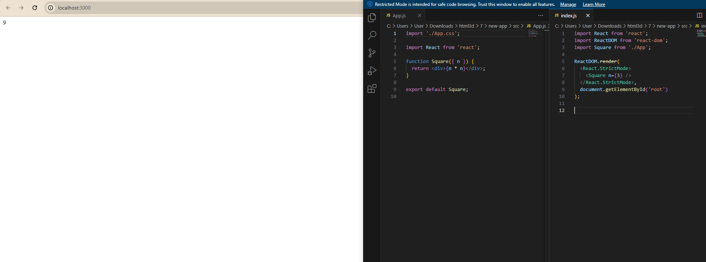
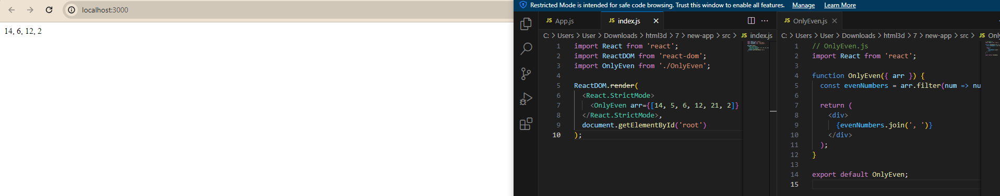
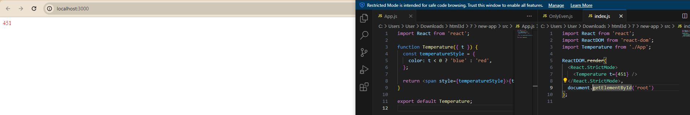
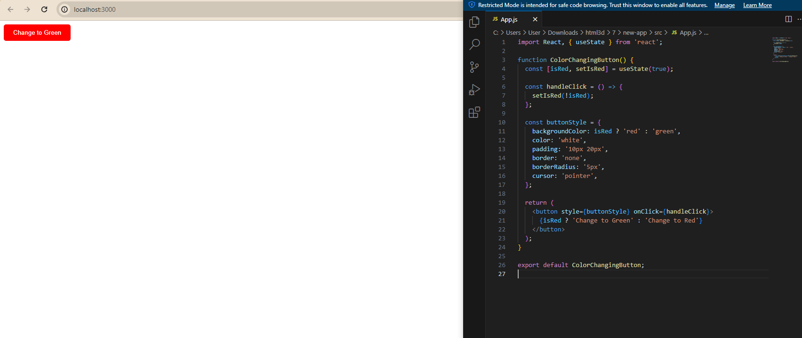
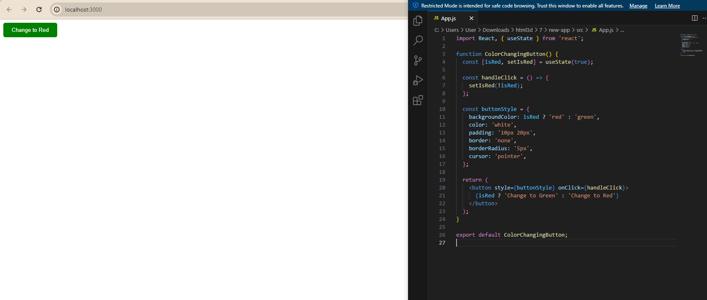

# Задачи с изображениями

## Задача 1
Написать компонент, выводящий квадрат переданного числа: 

## Задача 2
Написать компонент, выводящий только чётные элементы переданного массива: 

## Задача 3
Написать компонент, отображающий переданную ему температуру воздуха. Если температура ниже нуля, отображаются синие цифры, если выше, то красные: 

## Задача 4
Сделать кнопку, которая при нажатии меняет цвет фона с красного на зелёный и обратно: 

 
